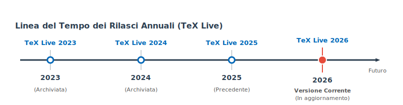

# Installazione locale di TeX Live

La modalità classica di lavorare con il sistema TeX è quella di installarlo sul
proprio computer: significa operare in *locale* e in *single user*.

[TeX Live](https://tug.org/texlive/) è la distribuzione TeX ufficiale; è
completa, multipiattaforma, e scaricabile liberamente dai server di
[CTAN](https://ctan.org/).

Esistono alternative, quella più nota è forse [MiKTeX](https://miktex.org/), ma
qui proporremo TeX Live in versione *vanilla*, ovvero quella non pacchettizzata,
installata direttamente dalla fonte.

## Ciclo di sviluppo di TeX Live

La cosa più importante da sapere di TeX Live è che ha un ciclo di sviluppo a
salti: ogni anno viene rilasciata una nuova versione. In quel momento, i
pacchetti della nostra installazione locale non riceveranno più aggiornamenti.

Siamo noi a dover decidere se e quando passare alla versione successiva. Di
solito chi utilizza LaTeX in modo continuativo esegue l'upgrade al rilascio
della nuova versione di TeX Live per disporre sempre di una piattaforma
aggiornata e con le nuove funzionalità.

Ogni rilascio annuale di TeX Live si installa allo stesso modo e non elimina la
versione precedente che potrà eventualmente essere eliminata successivamente.

## Schemi di installazione

L'installazione completa (*schema full*) di TeX Live comprende più di 5000
pacchetti, e comprende la [documentazione di sistema](../00-intro/systemdocs.md)
e i font con licenza libera. Occupa circa 10 GiB su disco.

Qui trovi le procedure passo passo per i principali sistemi operativi desktop:

- [Windows](windows.md)
- [macOS](macos.md)
- [Linux](linux.md)
- [Linux con verifica crittografica](linux-tlsafe.md)

> [!NOTE]
> In questa guida è trattata la procedura *Net installation* con lo schema
> *completo* di TeX Live. Per le altre modalità di installazione o per conoscere
> gli schemi disponibili consulta questa
> [guida](https://tug.org/texlive/doc.html).
