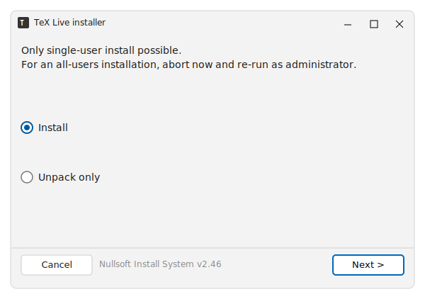
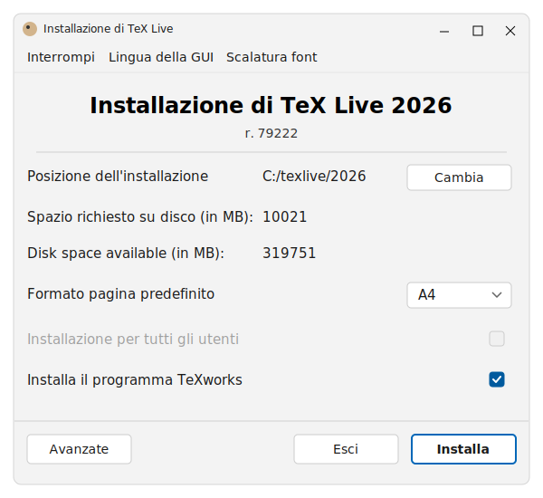
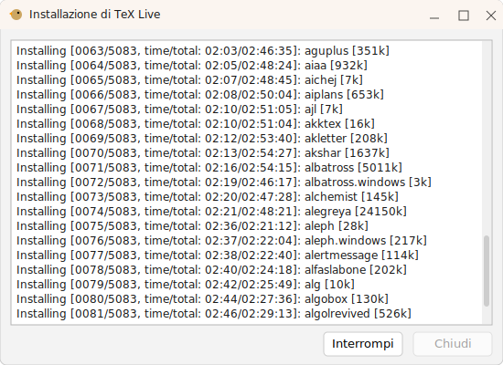

# Windows

Occorrente. Un PC connesso a Internet con il sistema operativo Windows.

## Passo 1: file di installazione

Per prima cosa scarica il file d'installazione
[install-tl-windows.exe](https://mirror.ctan.org/systems/texlive/tlnet/install-tl-windows.exe) ed eseguilo con un doppio click.

> [!NOTE]

> Windows è probabile che blocchi l'esecuzione dell'installer poiché non essendo
> firmato lo ritiene potenzialmente pericoloso. In tal caso nel dialogo di
> blocco fai click su "Ulteriori Informazioni". Apparirà il motivo, ovvero che
> l'autore dell'eseguibile è sconosciuto, e il pulsante "Esegui comunque".

Ti troverai in questa schermata:



Premi Next e poi Install per decomprimere in una cartella temporanea i file e
lanciare l'installatore vero e proprio.

> [!TIP]
> Se desideri che TeX Live sia disponibile per tutti gli utenti, gli account
> accreditati sul computer Windows, esegui l'installatore come amministratore
> scegliendo la voce corrispondente del menù contestuale con un click destro
> sull'icona

## Passo 2: Avvio dell'installazione

A questo punto dovresti essere alla schermata principale dell'installer.



Non è necessario fare modifiche nel dialogo per il tipo di installazione che
vogliamo fare tranne che per la scelta di installare o meno anche l'editor
TeXWorks, comodissimo perché offre la doppia finestra affiancata
codice/documento quindi consigliato.

Annota la directory "Posizione dell'installazione" che potrebbe essere utile in
seguito, e premi Install.

## Passo 3: Scaricamento pacchetti

Ottimo. Ultima fase: l'installer scarica e installa i pacchetti da uno dei
server CTAN. È una procedura lenta poiché i pacchetti sono veramente tanti.
Poco importa, 



Al termine dell'installazione dei pacchetti, vengono eseguite le configurazioni
finali e la generazione dei formati.

## Passo 4: test dell'installazione

Ora tutto è pronto per fare un semplice test. Premi il tasto Windows e digita i
caratteri `shell`. Fai invio sulla corrispondenza migliore per aprire una
finestra di Windows PowerShell. Al prompt digita il seguente comando e fai
un invio per confermarne l'esecuzione:

```bash
lualatex --version
```

Dovresti ottenere una serie di informazioni di versione che confermano che il
sistema è pronto all'uso.

Per ulteriori informazioni sull'installazione di TeX Live per Windows fai
riferimento alla pagina ufficiale
[windows.html](https://tug.org/texlive/windows.html).

## Passo 5: aggiornamenti

Ogni giorno vengono rilasciati aggiornamenti conviene quindi periodicamente
eseguire dal terminale il comando:

```bash
tlmgr update --all
```

## Passo 6 (raccomandato): verifica dei pacchetti

Fare in modo che gli aggiornamenti di TeX Live siano verificati è ottima cosa.
Vediamo in dettaglio.

Una volta in aggiornamento l'utility `tlmgr` stampa una prima riga che indica il
repository di riferimento:

```text
tlmgr.pl: package repository https://ctan.net/systems/texlive/tlnet/ (not verified: gpg unavailable)
```

Dall'ultima parte del messaggio è chiaro che in questo caso i pacchetti in
aggiornamento NON saranno verificati con `gpg`. Questo capita di norma su
Windows o MacOS ma non in Linux perché di solito `gnuPG` è già installato.

Risulta facilissimo installarlo anche in Windows o MacOS con quest'unico
comando che installa il necessario all'interno di TeX Live prelevando il
necessario dal repository di Norbert Preining:

```bash
tlmgr --repository http://www.preining.info/tlgpg/ install tlgpg
```

Facile, rapido e assolutamente consigliato.
