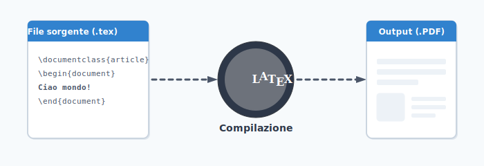

# Compilare il sorgente

I programmi TeX sono a riga di comando. Compilare un sorgente significa eseguire
il compositore in un terminale passandogli il nome del file.



Il comando va dato scrivendo il nome del compositore, per esempio `lualatex`,
seguito da uno spazio e dal nome del file con o senza estensione. Terminata la
digitazione del comando si preme il tasto invio per eseguirlo.

```bash
lualatex primodocumento.tex
```

## Estensione e codifica

L'estensione dei file sorgenti è `.tex` e la loro codifica Unicode `UTF-8`. In
questo modo il sorgente viene compilato allo stesso modo su diversi sistemi
operativi. Possiamo editare e compilare lo stesso sorgente in ufficio con
Windows, a casa con Linux e da un amico con macOS.

## Compilare con TeXworks

Gli editor di testo dedicati a LaTeX hanno molte facilitazioni tra cui la
compilazione con un click. Di più, spesso il PDF è mostrato a fianco del testo
sorgente ed è possibile fare click in un punto per spostarsi nel corrispondente
codice.

Uno degli editor più utilizzati è TeXworks. Per impostarlo a compilare con
`lualatex` basta scrivere come prima riga del file sorgente questo commento:

```text
% !TeX program = lualatex
```

Queste righe di commento vengono chiamate *righe magiche* e influenzano l'editor
su diversi aspetti uno dei quali è appunto stabilire come verrà compilato il
file al click sul bottone nella barra degli strumenti o alla pressione della
combinazione di tasti `CTRL + T`.


